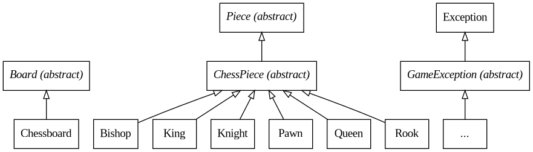
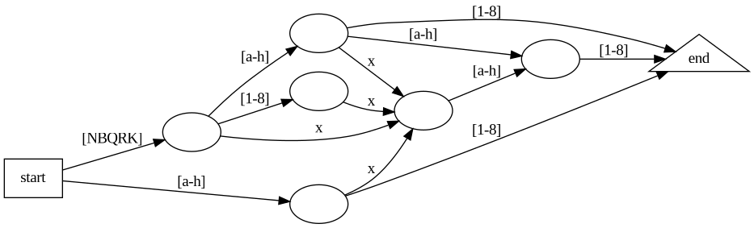
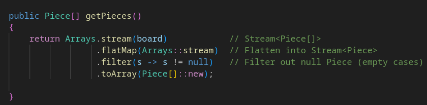

# Proposition de sujet - Échecs

## Hiérarchie des classes

## Automate

*Automate fini qui permet de retranscrire et valider des coups algébriques d'échecs PGN (ex: Nxd1, e1, exd2 ou R1xd1)*

Un automate fini est implémenté en utilisant un HashMap afin de stocker les règles pour passer d'un état à un autre (un peu à la manière d'un graphe ou d'une liste chaînée avec des maillons conditionnels). L'automate leur permettrait de bosser un peu les collections et également la généricité.

## Exemples

### 1. Stream
Pourrait aussi utiliser les streams pour récupérer en une ligne toutes les pièces non-nulles dans un array d'array de pièces.

### ...

### TODO

- Prise en passant
- Déplacement des pièces (presque déjà codé dans canTargetAt()) et vérifier que le roi n'est pas en échec à la fin du coup
- Calculer Pat et échec et mat

